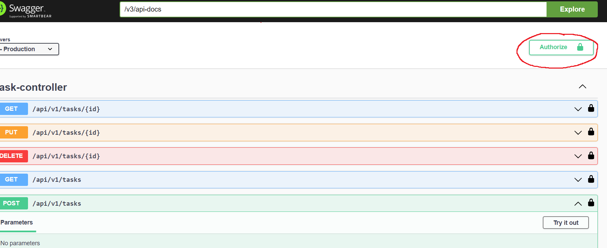

# Начало работы

### Запуск проекта
Далее поэтапно описан способ поднятия проекта и получения JWT токена

* Запускается проект через docker-compose.yaml
* Основной функционал находится по url : http://localhost:8080/swagger-ui/index.html#/
* Для начала работы необходимо зарегистрировать или авторизироваться
* Для регистрации используем API (POST) /api/v1/auth/register
* Для авторизации используем API (POST) /api/v1/auth/authenticate
* После регистрации или авторизации вводим полученный токен сюда 
  (Если что стоит поменять порты для бд)
### Описание проекта
Проект JWT Security:

* Данная система представляет из себя простой Task Manager System
* Возможность CRUD операций на тасками
* Присутсвует фильтр для тасков и пагинация вывода информации в api
* Присутвует базовая валидация запросов
* Возможность оставлять комментарии к таскам
* Желательно для удобство работа со свагером
* Вся среда (включая бд) поднимается в докере